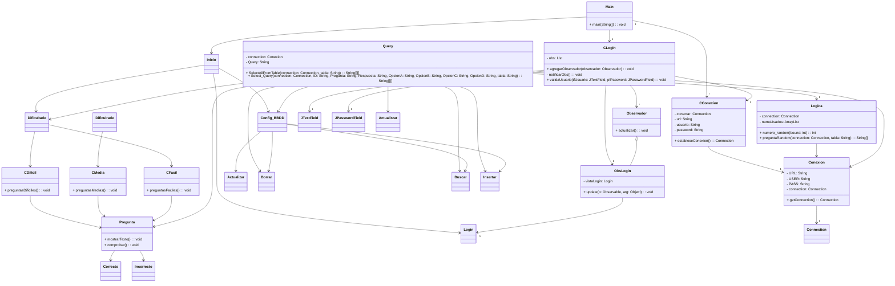

# Programa preguntas cultura general

---
Este programa recreativo tiene como objetivo la resolución de preguntas mediante 4 opciones dadas. También implementa una forma de iniciar sesión en una base de datos y la administración (inserción, borrado actualizado, consulta) de entradas en otra BBDD. Todo esto implementando el patrón de diseño MVC, Modelo-Vista-Controlador en Java.

### Arquitectura MVC

---
Nuestro programa sigue la arquitectura Modelo Vista Controlador para definir y separar las funcionalidades de cada elemento del código. Esto facilita su lectura, mantenimiento y posible escalabilidad.

El patrón de diseño sigue el siguiente esquema:

El modelo (Model). Engloba toda la lógica del proyecto. Eligiendo que preguntas mostrar y haciendo consultas a la BBDD.
La vista (View). La parte del proyecto con la que el usuario interactúa y proporciona datos a los métodos.
El controlador (Controler). Actua de intermediario gestionando las interacciones. Contiene la clase Main.

### Diagrama de clases

---

Este es el Diagrama de clases de este proyecto en especifico. 
La clase Query hace como libreria para despues instaciar los metodos en las otras clases. 
Y la clase Conexión es un Singleton.

### Diagrama de secuencias

---

Este es el Diagrama de secuencia de este proyecto en especifico.
